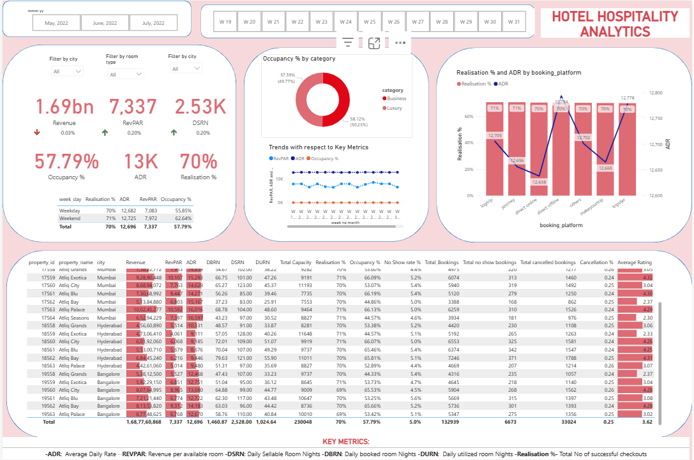

# Hotel Analytics Dashboard Project – Power BI

## Project Overview

This project presents a powerful, actionable hotel analytics dashboard built in Power BI, enabling hotel owners and managers to maximize revenue, optimize occupancy, and elevate guest satisfaction. The solution fully integrates daily operations, booking behavior, channel performance, and customer feedback into impactful visuals and analyses.

## Problem Statement

Hotel businesses struggle to consistently grow profit and manage occupancy due to fragmented data and static reporting. The absence of real-time analytical tools limits pricing agility, operational efficiency, and targeted marketing. This project solves these challenges by combining all business-critical data, metrics, and analysis within a scalable, interactive dashboard—empowering owners to make informed decisions and drive success.[2][5]

## Dataset & Data Model Structure

### Dataset Contents

- Property identifiers, city, room type/class, booking metadata
- Daily records from May–July
- Guest count, ratings, booking platform/channel performance
- Scheduled, checked out, canceled, and no-show bookings
- Room capacity and successful bookings

### Data Model: Star Schema

The Power BI solution utilizes a **star schema**, ensuring efficient queries and flexible reporting:
- **Fact Tables** (central):  
  - `fact_bookings`: All booking transactions  
  - `fact_aggregated_bookings`: Summarized booking/capacity data
- **Dimension Tables** (surrounding):  
  - `dim_hotels`: Hotel property info  
  - `dim_rooms`: Room classification  
  - `dim_date`: Calendar features for time intelligence
- **Key Measures Table**:  
  - `key_measures`: Houses central DAX measures (ADR, RevPAR, etc.) for streamlined reference and management

This model enables rapid analytics, easy drilldowns, and modular growth for new metrics or business questions.

Workflow: Data(csv) -> Power Query(Transform the data) -> Data Model -> DAX Measures -> Dashboard

## Key Metrics & DAX Measures

Every business-critical calculation was created as a reusable DAX measure:

Here is a table listing all the 26 DAX measures with their formulas, source tables, columns used, and purpose.:

| Sl No | Metric                  | Formula (DAX)                                                                                                                                                                                                                       | Table(s) Used            | Columns Used                        | Description / Purpose                                                                                     |
|-------|-------------------------|-----------------------------------------------------------------------------------------------------------------------------------------------------------------------------------------------------------------------------------|--------------------------|-----------------------------------|----------------------------------------------------------------------------------------------------------|
| 1     | Revenue                 | `SUM(fact_bookings[revenue_realized])`                                                                                                                                                                                            | fact_bookings            | revenue_realized                  | Total realized revenue generated from bookings                                                          |
| 2     | Total Bookings          | `COUNT(fact_bookings[booking_id])`                                                                                                                                                                                                | fact_bookings            | booking_id                        | Count of all bookings made                                                                                |
| 3     | Total Capacity          | `SUM(fact_aggregated_bookings[capacity])`                                                                                                                                                                                         | fact_aggregated_bookings | capacity                         | Total rooms capacity available in hotels                                                                |
| 4     | Total Successful Bookings| `SUM(fact_aggregated_bookings[successful_bookings])`                                                                                                                                                                              | fact_aggregated_bookings | successful_bookings              | Total number of successful bookings completed                                                           |
| 5     | Occupancy %             | `DIVIDE([Total Successful Bookings], [Total Capacity], 0)`                                                                                                                                                                        | fact_aggregated_bookings | successful_bookings, capacity    | Percentage of rooms occupied over total available                                                       |
| 6     | Average Rating          | `AVERAGE(fact_bookings[ratings_given])`                                                                                                                                                                                           | fact_bookings            | ratings_given                    | Average customer rating given to the hotel                                                              |
| 7     | No of days              | `DATEDIFF(MIN(dim_date[date]), MAX(dim_date[date]), DAY) + 1`                                                                                                                                                                      | dim_date                 | date                            | Total number of days in the dataset (e.g., May to July)                                                 |
| 8     | Total Cancelled Bookings| `CALCULATE([Total Bookings], fact_bookings[booking_status] = "Cancelled")`                                                                                                                                                         | fact_bookings            | booking_status                   | Count of bookings that were cancelled                                                                    |
| 9     | Cancellation %          | `DIVIDE([Total Cancelled Bookings], [Total Bookings])`                                                                                                                                                                            | fact_bookings            | booking_status                   | Percentage of bookings that were cancelled                                                               |
| 10    | Total Checked Out       | `CALCULATE([Total Bookings], fact_bookings[booking_status] = "Checked Out")`                                                                                                                                                       | fact_bookings            | booking_status                   | Count of bookings with checked-out status                                                                |
| 11    | Total No Show Bookings  | `CALCULATE([Total Bookings], fact_bookings[booking_status] = "No Show")`                                                                                                                                                           | fact_bookings            | booking_status                   | Count of bookings where guests did not show up                                                          |
| 12    | No Show Rate %          | `DIVIDE([Total No Show Bookings], [Total Bookings])`                                                                                                                                                                              | fact_bookings            | booking_status                   | Percentage of bookings where guests did not show up                                                     |
| 13    | Booking % by Platform   | `DIVIDE([Total Bookings], CALCULATE([Total Bookings], ALL(fact_bookings[booking_platform]))) * 100`                                                                                                                                 | fact_bookings            | booking_platform                | Percentage contribution of each booking platform                                                        |
| 14    | Booking % by Room Class | `DIVIDE([Total Bookings], CALCULATE([Total Bookings], ALL(dim_rooms[room_class]))) * 100`                                                                                                                                            | fact_bookings, dim_rooms | room_class                      | Percentage contribution of each room class                                                              |
| 15    | ADR (Average Daily Rate)| `DIVIDE([Revenue], [Total Bookings], 0)`                                                                                                                                                                                          | fact_bookings            | revenue_realized, booking_id    | Average revenue earned per booked room                                                                   |
| 16    | Realisation %           | `1 - ([Cancellation %] + [No Show Rate %])`                                                                                                                                                                                       | fact_bookings            | booking_status                   | Percentage of bookings successfully realized (checked out)                                              |
| 17    | RevPAR                  | `DIVIDE([Revenue], [Total Capacity])`                                                                                                                                                                                             | fact_bookings, aggregated| revenue_realized, capacity      | Revenue per available room (occupied or not), a key performance metric                                   |
| 18    | DBRN                    | `DIVIDE([Total Bookings], [No of days])`                                                                                                                                                                                          | fact_bookings, dim_date  | booking_id, date                | Average daily booked room nights over the period                                                         |
| 19    | DSRN                    | `DIVIDE([Total Capacity], [No of days])`                                                                                                                                                                                          | fact_aggregated_bookings, dim_date | capacity, date           | Average daily sellable room nights over the period                                                      |
| 20    | DURN                    | `DIVIDE([Total Checked Out], [No of days])`                                                                                                                                                                                       | fact_bookings, dim_date  | booking_status, date            | Average daily utilized room nights over the period                                                      |
| 21    | Revenue WoW Change %    | See full DAX with VAR and CALCULATE for week over week revenue change (detailed in previous response)                                                                                                                             | dim_date, fact_bookings  | wn, revenue_realized            | Week-over-week percentage change in revenue                                                             |
| 22    | Occupancy WoW Change %  | See full DAX with VAR and CALCULATE for week over week occupancy change (detailed in previous response)                                                                                                                           | dim_date, fact_aggregated_bookings| wn, capacity, successful_bookings | Week-over-week percentage change in occupancy percentage                                                 |
| 23    | ADR WoW Change %        | See full DAX with VAR and CALCULATE for week over week ADR change (detailed in previous response)                                                                                                                                  | dim_date, fact_bookings  | wn, revenue_realized, booking_id| Week-over-week percentage change in average daily rate                                                  |
| 24    | RevPAR WoW Change %     | See full DAX with VAR and CALCULATE for week over week RevPAR change (detailed in previous response)                                                                                                                              | dim_date, fact_bookings, fact_aggregated_bookings | wn, revenue_realized, capacity | Week-over-week percentage change in revenue per available room                                          |
| 25    | Realisation WoW Change %| See full DAX with VAR and CALCULATE for week over week realisation change (detailed in previous response)                                                                                                                        | dim_date, fact_bookings  | wn, booking_status             | Week-over-week percentage change in realisation percentage                                              |
| 26    | DSRN WoW Change %       | See full DAX with VAR and CALCULATE for week over week DSRN change (detailed in previous response)                                                                                                                                 | dim_date, fact_aggregated_bookings | wn, capacity                  | Week-over-week percentage change in daily sellable room nights                                          |

***

The dedicated `key_measures` table keeps these formulas organized, ensuring best practices in development and future scalability.

## Dashboard Visuals

### Core Visuals

- **Top KPIs**: Large cards for revenue, occupancy %, ADR, RevPAR, realization %, and DSRN.
- **Dynamic Filters**: By city, room type, and date/week.
- **Segmentation**: Donut chart for business vs. luxury demand.
- **Trend Charts**: Line/area charts for weekly and monthly movement in key metrics.
- **Channel Performance**: Bar & line combo of realization % and ADR by platform.
- **Performance Table**: Metric breakdown by property for benchmarking and scorecarding.
- **Conditional Formatting**: Visual data bars/icons for instant pattern recognition.[2][1]

### Drilldown & Level 2 Analysis

- Deeper analysis by room class, booking channel, cancellation cause, no-show trends.
- Week-on-week (WoW) change metrics to track results of campaigns, pricing, or operational changes.
- Extensible for guest segment, platform, product mix, and more advanced queries—addable on further dashboard pages thanks to robust underlying measures.

## Recommendations for Stakeholders

### Insights & Actions from Current Visuals

- Adjust pricing by city, category, and season based on ADR and occupancy trends.
- Prioritize distribution partners with high realization %, negotiating fees and incentives.
- Target guest service improvements for low-rated locations to drive repeat business.
- Tighten cancellation/no-show management with pre-arrival communication and policy edits.
- Allocate marketing resources to maximize high-demand periods and off-peak fill.

### Decisions Enabled by Level 2 Analysis

- Use detailed segment and channel breakdowns for hyper-targeted promotions and strategic partnerships.
- Diagnose root causes of cancellations/no-shows by platform and segment; design retention initiatives.
- Forecast and plan inventory, staffing, and expansions using granular WoW and time trend data.
- Measure specific marketing campaign ROI for smarter investment and message targeting.
- Continuously benchmark against peers for competitive advantage and innovation.

Here are clear, actionable recommendations for hotel stakeholders and business owners, based both on present dashboard visuals and on deeper insights available through Level 2 (Advanced Drilldowns). This aims to maximize business impact and ROI using your Power BI solution.[1][2][3][4][5]

***

## Recommendations from Current Dashboard Visuals

- **Revenue & Occupancy Optimization:**  
  Track weekly and monthly revenue, occupancy rates, and ADR to quickly identify drop-offs or surges. For sustained low occupancy, implement targeted promotions (discounts, packages) or enhance digital marketing for underperforming periods.

- **Channel Management:**  
  Use the realization % by booking platform to shift inventory toward high-yield, low-cancellation channels. Negotiate commissions or offer exclusive deals where platforms are driving bookings but cannibalizing margins.

- **Pricing Strategy:**  
  Compare ADR and RevPAR trends across cities and categories. Adjust pricing dynamically for weekdays vs. weekends and for business vs. luxury segments to maximize yield.

- **Guest Experience Enhancement:**  
  Correlate average rating with occupancy rates at each property. For locations or periods with poor ratings, launch service improvement or staff training immediately, as guest satisfaction strongly drives repeat bookings.

- **Cancellation & No-Show Control:**  
  Monitor cancellation % and no-show rate. Tighten cancellation policies where excessive, and improve pre-arrival communications to nudge guests toward completion and reduce no-shows, as this directly impacts net revenue.

- **Operational Benchmarking:**  
  Compare overall property and city performance using Key Metrics and conditional formatting in the visual table. Focus improvement plans on persistent underperformers, investigating root causes—be it staffing, price, or amenities.

***

## Strategic Decisions Enabled by Level 2 Analysis (Advanced Drilldowns)

- **Granular Channel & Segment Analysis:**  
  Drill down by booking platform, room class, or guest segment. Identify which channels or products drive the best realization, occupancy, and revenue—enabling precise, data-backed allocation of marketing budget, and strategic partnerships.

- **Actionable Cause Diagnosis:**  
  Use drilldowns into cancellation and no-show rates by city, platform, or guest segment to uncover specific causes. Launch focused retention, engagement, or operational reforms where drop-offs occur (e.g., particular platforms or guest types.)

- **Demand Forecasting & Inventory Planning:**  
  Apply week-over-week metrics and historical trend analysis to forecast peak and off-peak periods. Adjust room pricing, staffing, and availability proactively, anticipating local events or market shifts for optimal inventory and service levels.

- **Marketing ROI Measurement:**  
  Analyze the impact of promotions and campaigns by tracking targeted periods vs. control. Attribute revenue, occupancy, and guest satisfaction changes to specific efforts to finetune future campaigns.

- **Competitive Benchmarking:**  
  Integrate external market data and benchmark performance against peers, using RevPAR, ADR, and occupancy levels to guide investment and competitive positioning.

- **Product & Service Differentiation:**  
  Segment data by luxury vs. business, room class, city, or region. Discover emerging demand trends and develop targeted offerings or amenities (e.g., remote work packages, wellness stays) for specific customer groups.

***

**By following these recommendations, hotel business owners and stakeholders will be empowered to:**
- Maximize profitability while managing risk.
- Enhance customer satisfaction and retention.
- Minimize wasted expenditures, cancellations, and operational inefficiencies.
- Rapidly respond to changing market conditions and seize new opportunities for growth and differentiation.

## Value Proposition

This analytical solution delivers clarity, agility, and measurable results. Owners and managers can:
- Proactively respond to market shifts and emerging guest needs.
- Make precision decisions for pricing, marketing, and service enhancement.
- Scale insights with business growth, adding new data or analysis as needed.
- Save time, eliminate reporting errors, and gain competitive edge—through data-backed actionable recommendations.

**Hiring me with proven skills in Power BI, DAX modeling, and hotel hospitality data will ensures sustainable profit growth—by turning complex data into decisive business advantage.**

